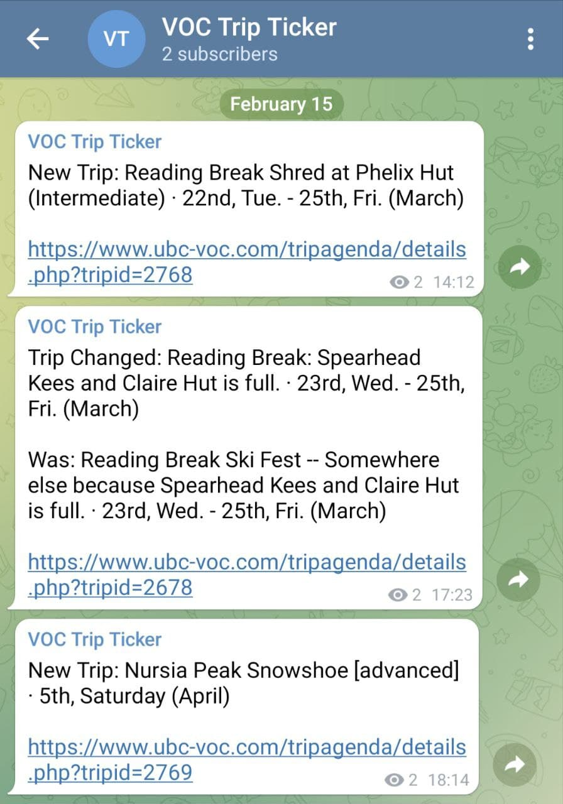

# VOC Trip Ticker Bot

This is a simple Telegram bot to notify users about new or changed trips of the [UBC Varsity Outdoor
Club](https://www.ubc-voc.com/). Subscribe to [@voctripticker](https://t.me/voctripticker) to get
updates about new and changed trips as soon as they are posted. 

The bot works by periodically requesting the trip agenda, comparing it with the trips it already
knows about and sending updates to the Telegram channel. 

If you want to know if the bot is still up, send `/start` to
[@VOCTripTickerBot](https://t.me/VOCTripTickerBot). If it responds, it still works.

## Deployment

If you just want to use the bot, subscribe to [@voctripticker](https://t.me/voctripticker). If you
want to play around with the code, you need your own bot token and Telegram channel.

1. Make sure that `python3.9` and `python3.9-venv` are installed.
2. Run `python3.9 -m venv .venv` in the project directory and activate the virtual environment using
   `source .venv/bin/activate`
3. Run `pip install -r requirements.txt`
4. Rename `.env.template` to `.env` and add the necessary credentials (or set them as environment
   variables)
5. Start the bot with `python tripbot.py`

